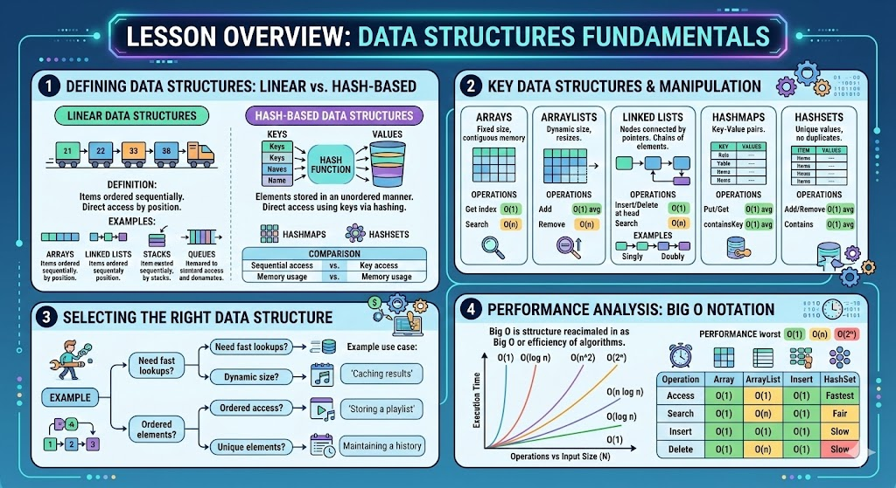

# [3.4] Data Structures and Algorithms (Part 1)

## Lesson Overview

## Dependencies
- [Self Studies](./studies.md)
- [Lesson](./lesson.md)
- [Assignment](./assignment.md)
- [Slide Deck](./slides.md)

## Lesson Objectives
* **Define and differentiate** between linear and hash-based data structures in Java
* **Implement and manipulate** Arrays, ArrayLists, LinkedLists, HashMaps, and HashSets to store and manage data
* **Apply appropriate data structures** for various problem types based on their performance characteristics
* **Analyze operation performance** using Big O notation to make informed design decisions

## Lesson Plan

| Duration | What | How or Why |
|----------|------|------------|
| 10 min | Warm up | Recap previous lesson |
| 15 min | Part 1: Introduction to Data Structures | Explain linear vs hash-based structures and why data structure choice matters |
| 25 min | Part 2: Arrays | Teach fixed-size indexed arrays with code-along; activity |
| 25 min | Part 2: ArrayList | Teach dynamic resizable lists with code-along; activity |
| 20 min | Part 2: LinkedList | Teach node-based structure with code-along; activity |
| 20 min | Part 3: HashMap | Teach key-value pairs and hashing with code-along; activity |
| 15 min | Big O Notation | Teach time complexity concepts with reference table |
| 15 min | Part 3: HashSet | Teach unique-element collections with code-along; activity |
| 15 min | Part 4: Comparison and Summary | Review all structures side by side using the comparison table |
| 20 min | Wrap up | Recap key takeaways, Q&A, and preview assignment |
| **Total** | | **180 min (3 hours)** |